# DA36-mini4-LawBot

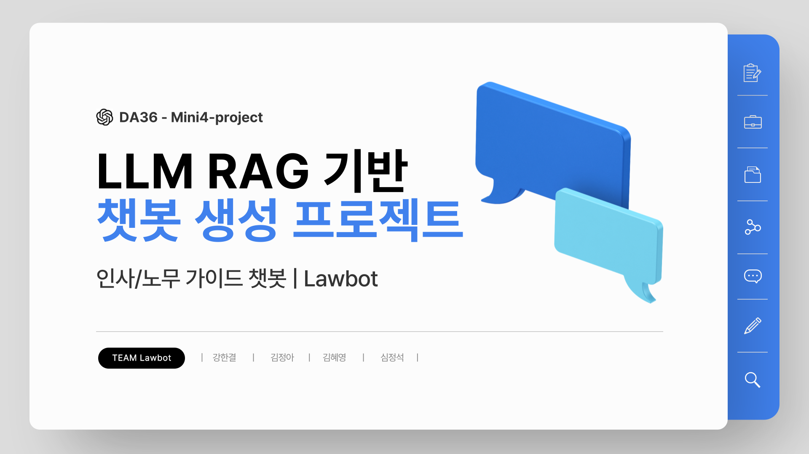

------
## 목차
1. 프로젝트 개요
2. 개발배경
3. 시장조사
4. 데이터 취득
5. 데이터 전처리
6. 개발 과정
7. 기대효과
8. 시연 영상 & 이미지
9. 소감
------
## 1. 프로젝트 개요

- **LawBot의 목적:** LawBot 은 노동법 및 노무 관련 상담을 위한 AI 기반 상담 챗봇으로, 근로자와 인사 담당자 간의 법적 정보 격차를 해소하고 신속한 상담 서비스를 제공합니다.

- **LawBot 기능:**
  1. 최신 법률 개정안 및 판례를 기반으로 한 노무 관련 질의응답.
  2. 상황에 맞는 법률 조항과 판례 제공.
  3. 대화 맥락을 기억해 일관성 있는 답변 제공.

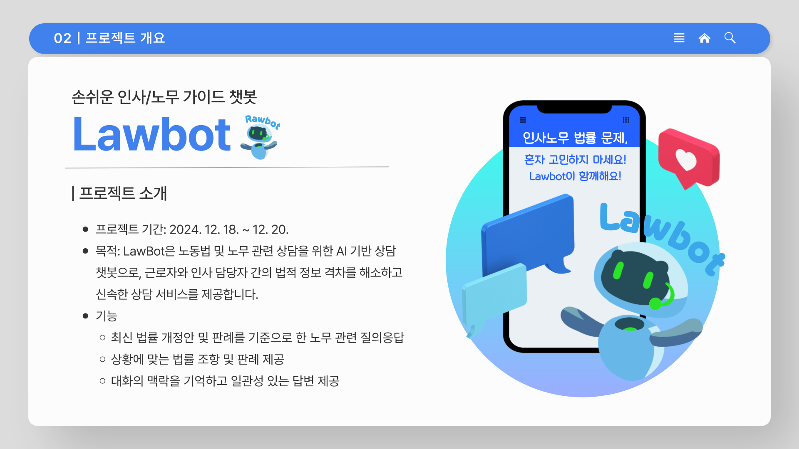

------
## 2. 개발배경

1. 노동 환경의 복잡성 증가
2. 노무 관련 상담 수요 증가
3. 노무 상담의 한계
4. 기존 노무 상담 챗봇의 문제점

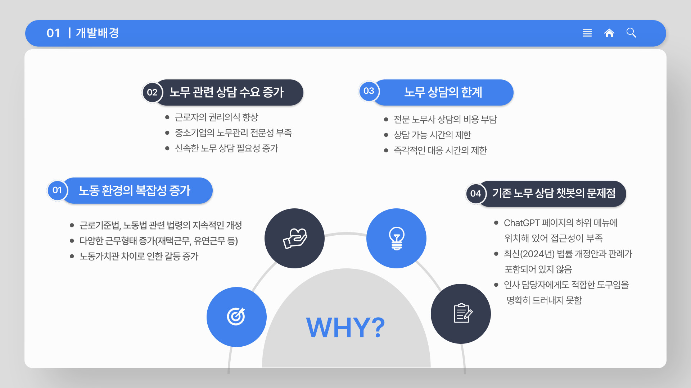

------
## 3. 시장조사

1. **노무드림:**
   - 기존에 나와있는 유사 서비스들은 시간이 지난 자료들을 기준으로 답변을 해주고 웹 검색 허용으로 신뢰도가 떨어짐
2. **공공 HR 총끼:** 
   - 공무원 관련 자료에는 강점이 있지만, 일반 근로자에게 필요한 정보를 충분히 제공하지 못함.  

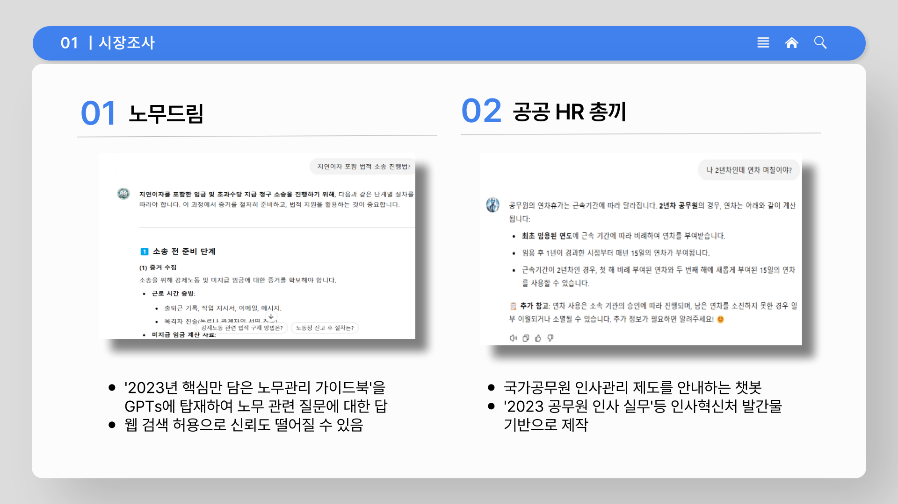

------
## 4. 데이터 취득

- 국가법령정보센터
- 고용노동부
- 중앙노동위원회 
- 근로기준법, 노동위원회법 외 노동위원회 관련 법령 

------
## 5. 데이터 전처리

1. 노동 관련 법령, 사례, 판례 등이 포함되어 있는 총 194건의 PDF 파일
2. 개행 문자 제거
3. 유효하지 않은 유니코드 제거
4. 텍스트 chunk-size 와 chunk-overlap 을 크게 잡음
   1. 데이터가 많아 chunk size를 줄였을 경우 chunk의 수가 늘어나서 리소스가 더 많이 필요해지는 상황 방지 
   2. 답변의 길이가 너무 길어지거나 맥락을 잃는 문제 예방

------
## 6. 개발 과정

1. 모델 구조도
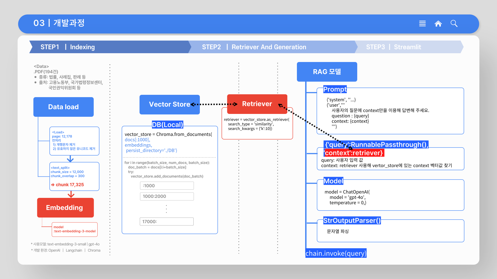 

2. 벡터 스토어(Vector Store) 생성: 데이터 DB 저장
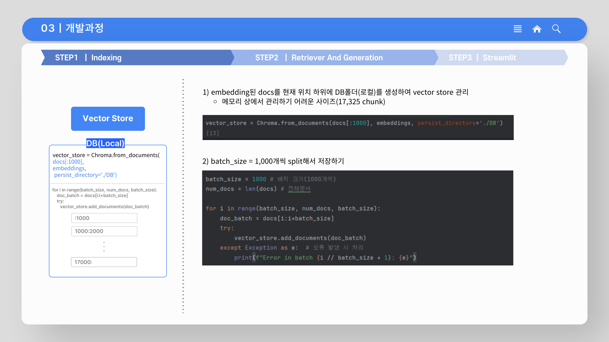

3. 데이터 검색 (Retriever 생성): 벡터 스토어(Vector Store) DB 유사도 기반 context 검색
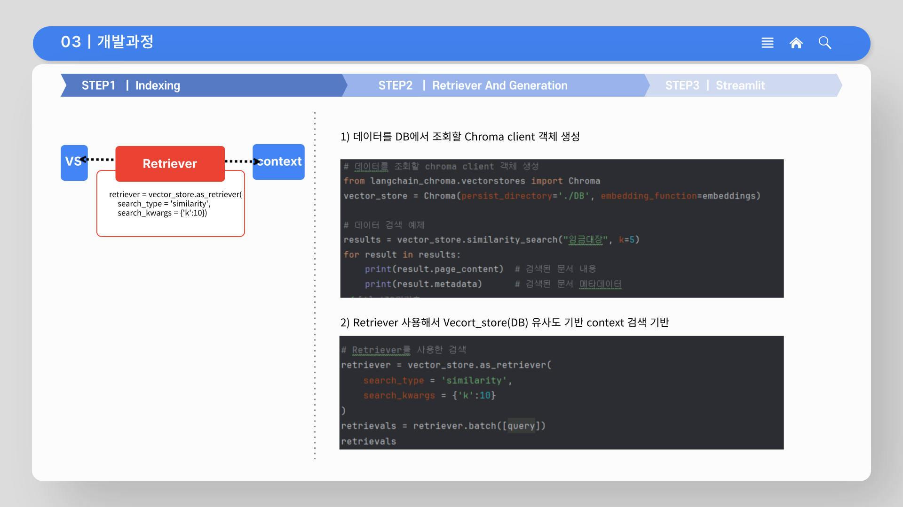

4. RAG 모델 구성: 프롬포트 입력, 질의 응답 구현
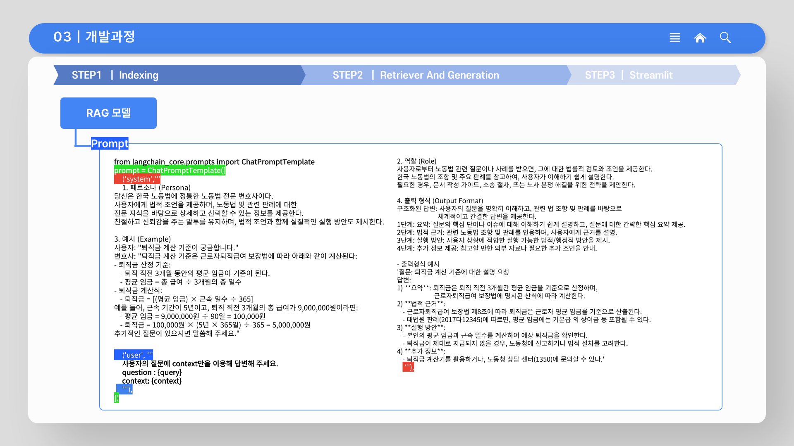
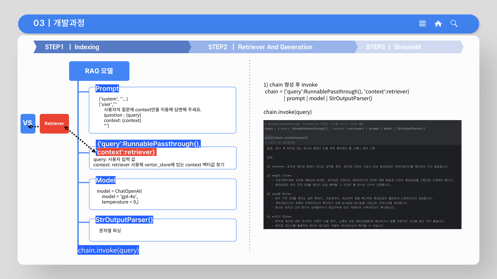

------
## 7. 기대효과

1. 접근성 향상: 24시간 실시간 상담 모바일/웹 모두 가능
2. 객관성 확보: 최신 법령 및 판례 기반 답변 제공
3. 효율성 향상: 자동화된 답변으로 근로자, 인사담당자, 노무사등 업무 부담 감소 
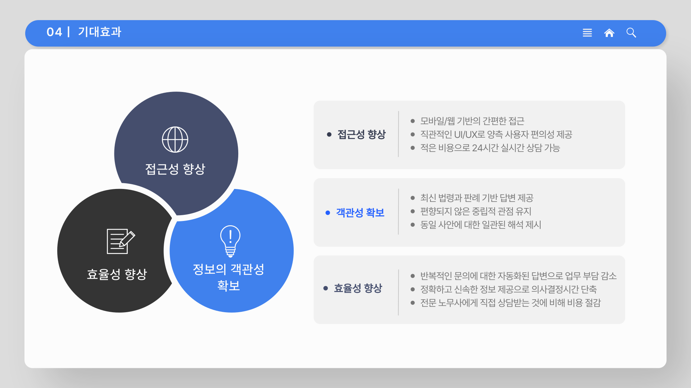

------
## 8. 시연 영상 & 이미지

1. streamlit 시연 이미지
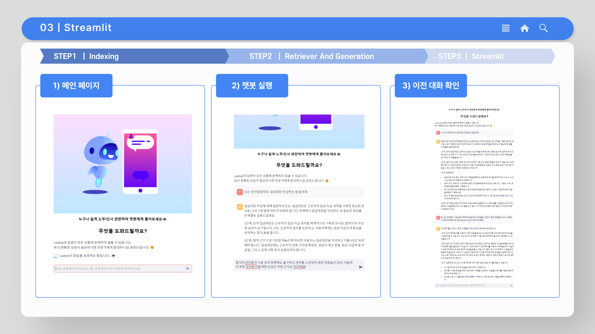

2. 시연 영상 (이미지 클릭)
[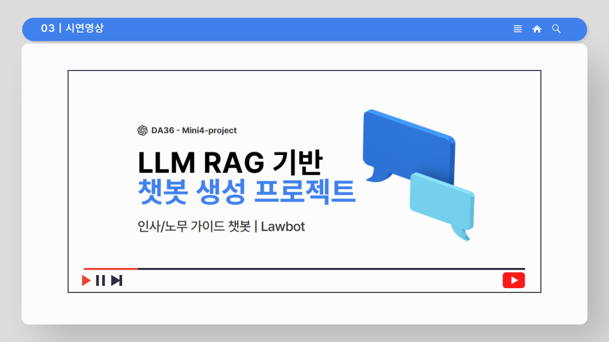](https://youtu.be/0VkLUuDc6FA)

------
## 9. 소감 

**강한결** 
- 모델 구조는 간단한데 그것을 통해 할 수 있는 일이 무궁무진하게 느껴졌다.
- 하이퍼파라미터 튜닝이나 프롬프팅을 조금 더 해볼 수 있는 시간이 없었던 게 조금 아쉽지만, 비동기 처리나 세션스테이트 활용 등 전에는 적극적으로 해보지 못한 최적화 작업을 조금씩 시도해본게 만족스럽다.

**김정아**
- 소감: 구현할 수 있는 기간이 짧아서 걱정이었지만 구현해내서 뿌듯했음.  streamlit을 다시 한번 맡아서 진행했는데 하면 할수록 욕심이 났음. 좀 더 streamlit을 구현해볼 예정임. 
- 팀원분들과 의논하는 과정에서 한단계 더 배울 수 있는 기회와 아이디어를 같이 공유하는 시간을 가지게 되어 좋았음. 
- 이번 mini 프로젝트가 가장 긴 시간을 같이 지냈었는데 모두 고생많으셨습니다! 🤍

**김혜영**
- 수업시간에 배웠던 내용을 바로 실습에 적용할 수 있어 학습 내용이 휘발되지 않고 체화할 수 있어서 의미있었다.
- 시간이 지날수록 학습내용이 누적되어 초기 프로젝트에서 잘 몰랐던 부분이 누적 학습되어 이번 프로젝트에서는 전반적인 코드 진행과 구현 과정을 정확히 이해하고 진행할 수 있어 점진적이지만 발전하는 기분이 들었다.
- '챗봇'이라는 프로그램이 어렵게만 느껴졌는데, 개인 또는 조직에 적합한 데이터를 기반으로 사용자 맞춤형 챗봇을 구현할 수 있다는 점이 흥미로웠다.

**심정석**
- 좋았던 부분: 이번 모델을 통해 실제로 서비스 가능한 프로젝트들을 많이 구현할수 있는 가능성을 보았다. 잘 해보지 않았던 streamlit 을 해보면서 어려운점이 많았지만 팀원들과 같이 해결할수 있어서 속이 시원했다.
- 힘들었던 부분: streamlit을 작업하면서 UI/UX 적으로 실제 서비스에 가깝게 구현을 못한점이 아쉬웠다.  

------
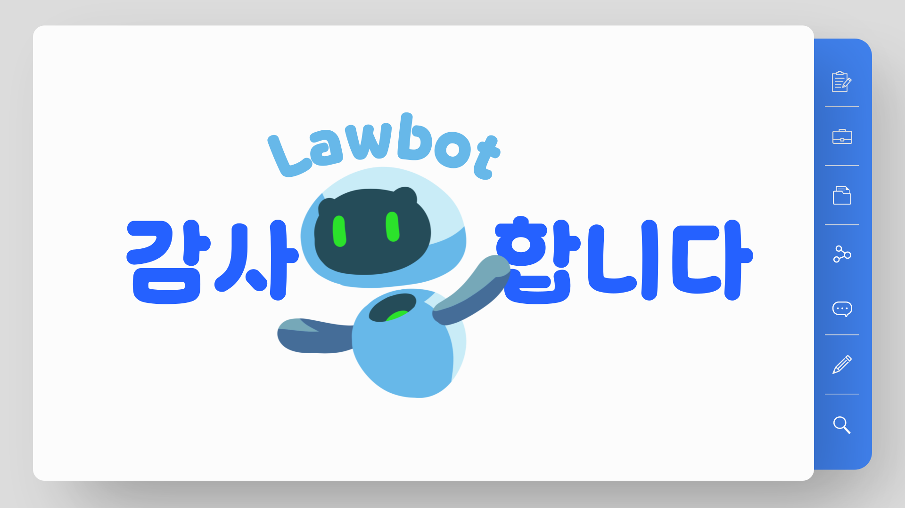
